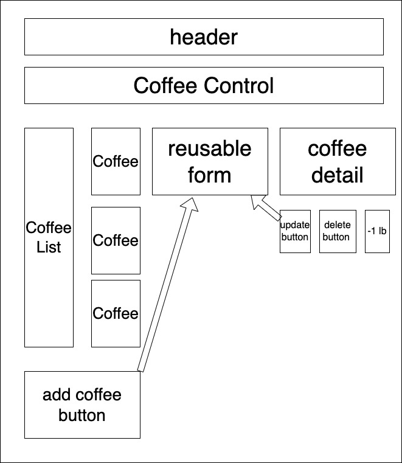

# Coffee Control

#### By Todd Pangilinan

A react app that keeps track of coffee types and amount.

## Technologies Used

* React
* JavaScript
* NPM
* HTML
* CSS

## Description:
A simple app/website that uses React (and state) to keep track of a fictional coffee shop's supplies. It allows users to enter in different "sacks" of coffee, each sack contains 130 pounds of coffee. Users can input the name, roast, origin, and cost per lb for each type of coffee. It then allows the user to keep track of the amount of each coffee entered.

The following user stories were considered in planning this app:

* As a user, I want to see a list/menu of all available types of coffee beans.
* For each item, I want to see its name, origin, price, and roast (light, medium, or dark) of the coffee bean.
* As a user, I want to submit a form to add a new burlap sack of coffee to the inventory.
* As a user, I want to be able to click on a burlap sack to see its detail page.
* As a user, I want to see how many pounds of coffee beans are left in a burlap sack. A burlap sack has roughly 130 pounds.
* As a user, I want to be able to click a button to sell a pound of coffee beans. This should decrease the number of pounds left by 1. The number of pounds in a sack of coffee beans should not be able to go below 0.
* As a user, I want the option to edit a coffee sack's properties after entering them just in case I make a mistake.
* As a user, I want to be able to delete a coffee sack.
* As a user, I want a coffee sack to update to say "Out of Stock" once it's empty.

## diagram of the app

## Setup/Installation Requirements

* If you don't have Git installed on your machine, follow these [instructions.](https://www.learnhowtoprogram.com/introduction-to-programming/getting-started-with-intro-to-programming/git-and-github)
* Via your terminmal, navigate to the directory you want to store my files in.
* Clone my git hub directory by typing or cutting pasting: "git clone https://github.com/pangtodd/exchange_rate.git" into your terminal.
* open files in a code editor of your choice.
* NOTE: this project was created in a Mac environment. There may be minor changes if you use a PC.
* open terminal or bash, and navigate to the root level of the project, enter "npm install".
* After the dependencies have been loaded, in the terminal, run "npm run start". This should bring up a browswer to localhost3000 and start the app.

## Known Bugs

* When editing a coffee, you must complete all fields, othewise, they return as null. Didn't have time to fix that, but probably could add a conditional to address that.
* As of 8/13/2022, no other known bugs
* email pang.todd@gmail.com if you notice any problems or have feedback

## License

[MIT](https://opensource.org/licenses/MIT)
Copyright (c) Todd Pangilinan 

## Contact Information
pang.todd@gmail.com